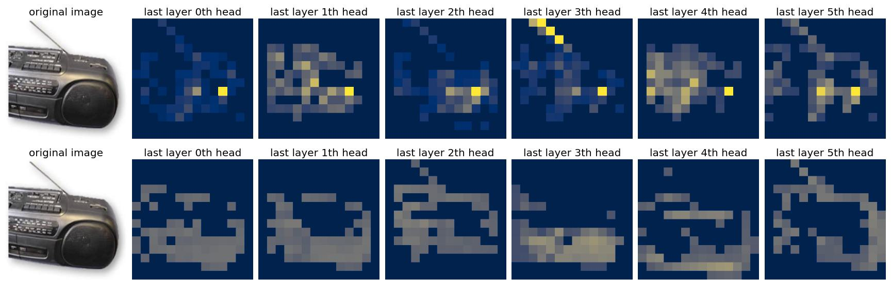
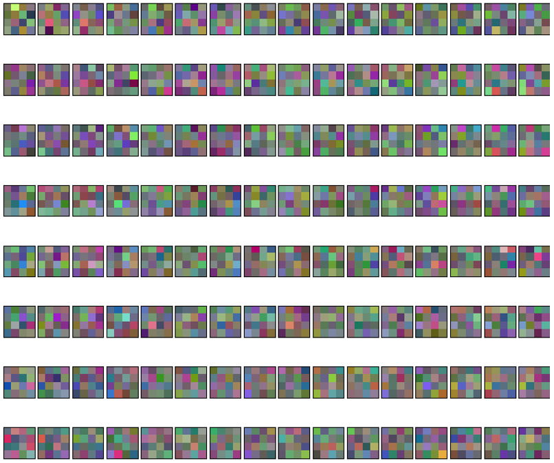

This repository is an unofficial PyTorch implementation of Feedforward and Transformer based Networks (such as mlp-mixer, vit, ...). most experiments are performed on small benchmark datasets.
 
 

# Experiement Results
|Model|Params (M)|CIFAR10|CIFAR100|SVHN|
|------|---|---|---|---|
|MLP-Mixer|1.13|84.73%|56.69%|93.88%|
|ResMLP|1.09|88.12%|64.72%|95.98%|
|Conv-Mixer|29.54|82.41%|57.19%|93.43%|
|Vit|18.94|83.41%|56.10%|94.84%|
 

# Layer Visualization Results
This is a visualization of the attention map of the last layer of Vit and dino. The top figure is Vit pretrained from the Imagenet dataset, and the bottom figure is the result of dino's attention map visualization.

This is the result of visualizing the embedding layer of mlp-mixer trained on cifar10. (patch size=4)

# Reference
- Tiny-ImageNet: http://cs231n.stanford.edu/tiny-imagenet-200.zip
- Imagenette: https://github.com/fastai/imagenette
- https://github.com/abhishekkrthakur/tez
- https://github.com/lucidrains/vit-pytorch/tree/main/vit_pytorch